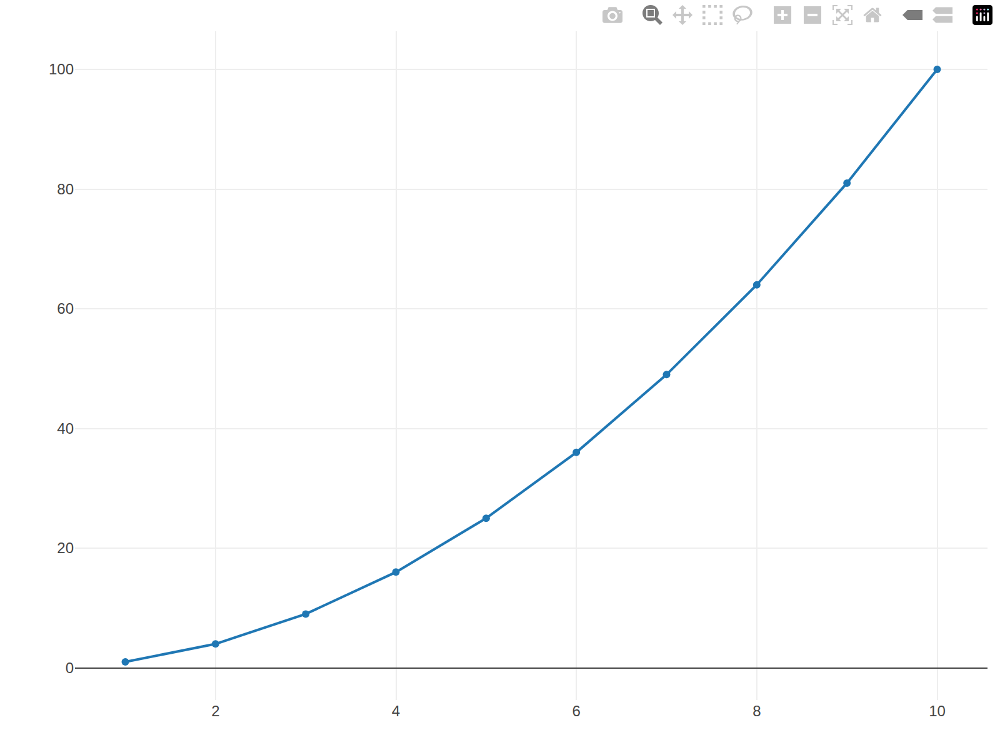

```{r}
library(plotly)

# Crear gráfico interactivo de mtcars
p <- plot_ly(
  data = mtcars, 
  x = ~hp, 
  y = ~mpg, 
  type = "scatter", 
  mode = "markers",
  color = ~as.factor(cyl), 
  size = ~wt,
  text = ~paste("Modelo:", rownames(mtcars))
) %>%
  layout(
    title = "Caballos de Fuerza vs Millas por Galón",
    xaxis = list(title = "Caballos de Fuerza (hp)"),
    yaxis = list(title = "Millas por Galón (mpg)"),
    legend = list(title = list(text = "Cilindros"))
  )

# Mostrar gráfico
#p


```


```{r}
library(plotly)

# Guardar como PNG
plotly::export(
  p, 
  file = "mi_grafico.png", 
  vwidth = 1200,   # Ancho en píxeles
  vheight = 800    # Alto en píxeles
)
```


```{r}
list.files(path = ".")
```


```{r}
#| echo: false
#| fig-align: center
#| out-width: "100%"

# Si ya tienes el archivo físico en la carpeta


```
